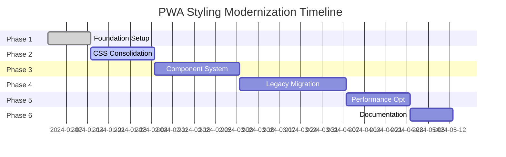

# 🚀 PWA Styling Modernization Plan
**Complete Architecture Overhaul & Upgrade Strategy**

## 📋 Executive Summary

This document outlines a comprehensive **6-phase modernization plan** to completely overhaul the Pokemon Card Tracker PWA styling architecture. The plan addresses critical technical debt, implements 2024 best practices, and establishes a scalable foundation for future development.

### **Current State Assessment**
- ❌ **13+ CSS files** with overlapping responsibilities
- ❌ **4 different styling approaches** causing confusion
- ❌ **Long utility chains** (10+ classes per element)
- ❌ **Mixed paradigms** (utilities + custom CSS + variables)
- ❌ **Hard-coded values** scattered throughout codebase
- ❌ **No TypeScript** for styling validation
- ❌ **Manual class ordering** and formatting
- ❌ **Complex conditional logic** in component styling

### **Target State Vision**
- ✅ **Unified styling system** with clear architecture
- ✅ **TypeScript-first** approach with strict typing
- ✅ **Automated tooling** for consistency and quality
- ✅ **Performance optimized** build process
- ✅ **Developer experience** improvements
- ✅ **Maintainable** and **scalable** codebase

---

## 🎯 Modernization Objectives

### **Primary Goals**
1. **Eliminate Technical Debt**: Remove inconsistencies and redundancies
2. **Implement 2024 Standards**: Adopt current industry best practices
3. **Improve Developer Experience**: Better tooling, TypeScript, automation
4. **Enhance Performance**: Optimize build size and runtime performance
5. **Establish Scalability**: Create maintainable architecture for growth

### **Success Metrics**
- 🎯 **Bundle Size**: Reduce CSS bundle by 30-40%
- 🎯 **Build Time**: Improve build performance by 25%
- 🎯 **Developer Velocity**: Reduce styling implementation time by 50%
- 🎯 **Code Quality**: Achieve 95%+ linting pass rate
- 🎯 **Maintainability**: Eliminate duplicate/redundant styles

---

## 📅 PHASE 1: Foundation & Tooling Setup
**Duration: 1-2 weeks | Priority: CRITICAL**

### **🔧 Development Tooling Installation**

#### **1.1 TypeScript Integration**
```bash
# Install TypeScript for React
npm install --save-dev typescript @types/react @types/react-dom @types/node

# Create tsconfig.json
{
  "compilerOptions": {
    "target": "es5",
    "lib": ["dom", "dom.iterable", "es6"],
    "allowJs": true,
    "skipLibCheck": true,
    "esModuleInterop": true,
    "allowSyntheticDefaultImports": true,
    "strict": true,
    "forceConsistentCasingInFileNames": true,
    "moduleResolution": "node",
    "resolveJsonModule": true,
    "isolatedModules": true,
    "noEmit": true,
    "jsx": "react-jsx"
  },
  "include": ["src"]
}
```

#### **1.2 Modern Styling Tools**
```bash
# Class Variance Authority for component variants
npm install class-variance-authority

# clsx for conditional classes
npm install clsx

# Tailwind CSS IntelliSense and sorting
npm install --save-dev prettier-plugin-tailwindcss

# ESLint rules for Tailwind
npm install --save-dev eslint-plugin-tailwindcss
```

#### **1.3 Build Optimization**
```bash
# Bundle analyzer
npm install --save-dev webpack-bundle-analyzer

# PostCSS optimization plugins
npm install --save-dev cssnano autoprefixer

# Tailwind CSS JIT optimizations
npm install --save-dev @tailwindcss/jit
```

### **🛠️ Configuration Files**

#### **1.4 ESLint Configuration**
```javascript
// .eslintrc.js
module.exports = {
  extends: [
    'react-app',
    'react-app/jest',
    'plugin:tailwindcss/recommended'
  ],
  plugins: ['tailwindcss'],
  rules: {
    'tailwindcss/classnames-order': 'error',
    'tailwindcss/no-custom-classname': 'warn',
    'tailwindcss/no-contradicting-classname': 'error'
  }
};
```

#### **1.5 Prettier Configuration**
```javascript
// .prettierrc.js
module.exports = {
  plugins: ['prettier-plugin-tailwindcss'],
  tailwindConfig: './tailwind.config.js',
  tailwindFunctions: ['clsx', 'cn', 'cva']
};
```

### **📊 Phase 1 Deliverables**
- [ ] TypeScript configuration complete
- [ ] Modern tooling installed and configured
- [ ] ESLint + Prettier rules enforcing best practices
- [ ] Bundle analyzer reporting baseline metrics
- [ ] Development workflow documentation

---

## 📅 PHASE 2: CSS Architecture Consolidation
**Duration: 2-3 weeks | Priority: HIGH**

### **🏗️ File Structure Reorganization**

#### **2.1 New CSS Architecture**
```
src/
├── styles/
│   ├── globals.css                 # Global resets + Tailwind imports
│   ├── tokens.css                  # Design tokens only
│   └── utilities.css               # Custom utility classes
├── components/
│   └── ui/                         # Reusable UI components
│       ├── button.tsx              # Button component with variants
│       ├── modal.tsx               # Modal component
│       ├── dropdown.tsx            # Dropdown component
│       └── index.ts                # Barrel exports
└── lib/
    ├── utils.ts                    # Utility functions (cn, clsx)
    └── variants.ts                 # CVA variant definitions
```

#### **2.2 Design Token Consolidation**
```css
/* src/styles/tokens.css */
:root {
  /* Color Tokens - Semantic Naming */
  --color-primary-50: #fef2f2;
  --color-primary-100: #fee2e2;
  --color-primary-500: #ef4444;
  --color-primary-600: #dc2626;
  --color-primary-900: #7f1d1d;
  
  /* Surface Tokens */
  --color-surface-primary: #ffffff;
  --color-surface-secondary: #f9fafb;
  --color-surface-inverse: #111827;
  
  /* Semantic Tokens */
  --color-success: #22c55e;
  --color-warning: #f59e0b;
  --color-error: #ef4444;
  --color-info: #3b82f6;
  
  /* Spacing Scale */
  --space-1: 0.25rem;
  --space-2: 0.5rem;
  --space-3: 0.75rem;
  --space-4: 1rem;
  --space-6: 1.5rem;
  --space-8: 2rem;
  
  /* Typography Scale */
  --font-size-xs: 0.75rem;
  --font-size-sm: 0.875rem;
  --font-size-base: 1rem;
  --font-size-lg: 1.125rem;
  --font-size-xl: 1.25rem;
  
  /* Border Radius */
  --radius-sm: 0.375rem;
  --radius-md: 0.5rem;
  --radius-lg: 0.75rem;
  --radius-xl: 1rem;
  
  /* Z-Index Scale */
  --z-dropdown: 1000;
  --z-modal: 1050;
  --z-tooltip: 1060;
  --z-header: 2000;
}
```

#### **2.3 Tailwind Config Overhaul**
```javascript
// tailwind.config.js
/** @type {import('tailwindcss').Config} */
module.exports = {
  content: ['./src/**/*.{js,jsx,ts,tsx}'],
  darkMode: 'class',
  theme: {
    extend: {
      colors: {
        primary: {
          50: 'var(--color-primary-50)',
          100: 'var(--color-primary-100)',
          500: 'var(--color-primary-500)',
          600: 'var(--color-primary-600)',
          900: 'var(--color-primary-900)',
        },
        surface: {
          primary: 'var(--color-surface-primary)',
          secondary: 'var(--color-surface-secondary)',
          inverse: 'var(--color-surface-inverse)',
        },
        semantic: {
          success: 'var(--color-success)',
          warning: 'var(--color-warning)',
          error: 'var(--color-error)',
          info: 'var(--color-info)',
        }
      },
      spacing: {
        1: 'var(--space-1)',
        2: 'var(--space-2)',
        3: 'var(--space-3)',
        4: 'var(--space-4)',
        6: 'var(--space-6)',
        8: 'var(--space-8)',
      },
      borderRadius: {
        sm: 'var(--radius-sm)',
        md: 'var(--radius-md)',
        lg: 'var(--radius-lg)',
        xl: 'var(--radius-xl)',
      },
      zIndex: {
        dropdown: 'var(--z-dropdown)',
        modal: 'var(--z-modal)',
        tooltip: 'var(--z-tooltip)',
        header: 'var(--z-header)',
      }
    },
  },
  plugins: [],
};
```

### **🗂️ File Migration Strategy**

#### **2.4 CSS File Consolidation Plan**
```markdown
**REMOVE (Delete entirely):**
- src/styles/variables.css         → Merge into tokens.css
- src/styles/shared.css            → Convert to components
- src/styles/black-background.css  → Integrate into dark mode classes
- src/design-system/styles/colors.js → Move to tailwind.config.js
- src/design-system/styles/component-library.css → Convert to TypeScript components

**KEEP & REFACTOR:**
- src/styles/main.css             → Rename to globals.css, clean up
- src/styles/ios-fixes.css        → Keep PWA-specific styles
- src/styles/design-system.css    → Convert to utilities.css

**NEW FILES:**
- src/styles/tokens.css           → Centralized design tokens
- src/lib/utils.ts               → Utility functions
- src/lib/variants.ts            → CVA variant definitions
```

### **📊 Phase 2 Deliverables**
- [ ] CSS file count reduced from 13+ to 4 files
- [ ] All design tokens centralized and semantic
- [ ] Tailwind config using CSS custom properties
- [ ] File structure reorganized and documented
- [ ] Migration script for existing styles

---

## 📅 PHASE 3: Component System Modernization
**Duration: 3-4 weeks | Priority: HIGH**

### **🧱 Component Architecture Redesign**

#### **3.1 Utility Function Setup**
```typescript
// src/lib/utils.ts
import { type ClassValue, clsx } from 'clsx';
import { twMerge } from 'tailwind-merge';

export function cn(...inputs: ClassValue[]) {
  return twMerge(clsx(inputs));
}

export function cva<T>(base: string, config: T) {
  return (props: any) => {
    // CVA implementation
  };
}
```

#### **3.2 Modern Button Component**
```typescript
// src/components/ui/button.tsx
import * as React from 'react';
import { cva, type VariantProps } from 'class-variance-authority';
import { cn } from '@/lib/utils';

const buttonVariants = cva(
  'inline-flex items-center justify-center rounded-md text-sm font-medium transition-colors focus-visible:outline-none focus-visible:ring-2 focus-visible:ring-offset-2 disabled:pointer-events-none disabled:opacity-50',
  {
    variants: {
      variant: {
        default: 'bg-primary-500 text-white hover:bg-primary-600',
        destructive: 'bg-semantic-error text-white hover:bg-red-600',
        outline: 'border border-primary-500 text-primary-500 hover:bg-primary-50',
        secondary: 'bg-surface-secondary text-gray-900 hover:bg-gray-200',
        ghost: 'hover:bg-surface-secondary',
        link: 'text-primary-500 underline-offset-4 hover:underline',
      },
      size: {
        default: 'h-10 px-4 py-2',
        sm: 'h-9 rounded-md px-3',
        lg: 'h-11 rounded-md px-8',
        icon: 'h-10 w-10',
      },
    },
    defaultVariants: {
      variant: 'default',
      size: 'default',
    },
  }
);

export interface ButtonProps
  extends React.ButtonHTMLAttributes<HTMLButtonElement>,
    VariantProps<typeof buttonVariants> {
  asChild?: boolean;
}

const Button = React.forwardRef<HTMLButtonElement, ButtonProps>(
  ({ className, variant, size, asChild = false, ...props }, ref) => {
    return (
      <button
        className={cn(buttonVariants({ variant, size, className }))}
        ref={ref}
        {...props}
      />
    );
  }
);
Button.displayName = 'Button';

export { Button, buttonVariants };
```

#### **3.3 Modern Modal Component**
```typescript
// src/components/ui/modal.tsx
import * as React from 'react';
import { cva, type VariantProps } from 'class-variance-authority';
import { cn } from '@/lib/utils';

const modalVariants = cva(
  'fixed inset-0 z-modal flex items-center justify-center',
  {
    variants: {
      backdrop: {
        default: 'bg-black/50 backdrop-blur-sm',
        dark: 'bg-black/70 backdrop-blur-md',
        light: 'bg-white/20 backdrop-blur-sm',
      },
    },
    defaultVariants: {
      backdrop: 'default',
    },
  }
);

const modalContentVariants = cva(
  'relative flex flex-col overflow-hidden rounded-lg shadow-xl',
  {
    variants: {
      size: {
        sm: 'w-full max-w-sm',
        md: 'w-full max-w-md',
        lg: 'w-full max-w-lg',
        xl: 'w-full max-w-xl',
        full: 'w-screen h-screen',
      },
      theme: {
        light: 'bg-white text-gray-900',
        dark: 'bg-gray-900 text-white',
      },
    },
    defaultVariants: {
      size: 'md',
      theme: 'light',
    },
  }
);

export interface ModalProps extends VariantProps<typeof modalVariants> {
  isOpen: boolean;
  onClose: () => void;
  children: React.ReactNode;
  size?: VariantProps<typeof modalContentVariants>['size'];
  theme?: VariantProps<typeof modalContentVariants>['theme'];
  className?: string;
}

export function Modal({
  isOpen,
  onClose,
  children,
  backdrop,
  size,
  theme,
  className,
}: ModalProps) {
  if (!isOpen) return null;

  return (
    <div className={cn(modalVariants({ backdrop }))} onClick={onClose}>
      <div
        className={cn(modalContentVariants({ size, theme, className }))}
        onClick={(e) => e.stopPropagation()}
      >
        {children}
      </div>
    </div>
  );
}
```

### **🔄 Component Migration Strategy**

#### **3.4 Migration Phases**
```markdown
**WEEK 1: Core UI Components**
- Button (variants: default, destructive, outline, secondary, ghost, link)
- Modal (sizes: sm, md, lg, xl, full + themes)
- Input (types: text, email, password, number + states)
- Badge (variants: default, secondary, destructive, outline)

**WEEK 2: Layout Components**
- Card (with header, content, footer sections)
- Container (responsive padding and max-widths)
- Grid (responsive grid layouts)
- Stack (vertical/horizontal spacing)

**WEEK 3: Complex Components**
- Dropdown (with BottomSheet mobile adaptation)
- SearchToolbar (responsive layout variants)
- Navigation (BottomNavBar + responsive patterns)
- Form Components (with validation states)

**WEEK 4: Integration & Testing**
- Component integration testing
- Visual regression testing setup
- Performance benchmarking
- Documentation generation
```

### **📊 Phase 3 Deliverables**
- [ ] 20+ modern TypeScript components created
- [ ] CVA variant system implemented
- [ ] Component library documentation
- [ ] Migration guide for existing components
- [ ] Performance benchmarks documented

---

## 📅 PHASE 4: Legacy Component Migration
**Duration: 4-5 weeks | Priority: MEDIUM**

### **🔄 Component-by-Component Migration**

#### **4.1 SearchToolbar Modernization**
```typescript
// BEFORE (100+ lines of complex logic)
const toolbarClass = `search-toolbar w-full bg-white dark:bg-[#1B2131] py-3 px-4 flex flex-col sm:flex-row items-stretch sm:items-center gap-3 ${isDarkMode ? 'shadow-sm' : ''} rounded-md border border-[#ffffff33] dark:border-[#ffffff1a] ${className}`;

// AFTER (Clean TypeScript component)
const searchToolbarVariants = cva(
  'search-toolbar w-full py-3 px-4 rounded-md border',
  {
    variants: {
      layout: {
        mobile: 'flex flex-col items-stretch gap-3',
        desktop: 'flex flex-row items-center gap-3',
      },
      theme: {
        light: 'bg-white border-gray-300',
        dark: 'bg-gray-900 border-gray-700',
      },
      shadow: {
        none: '',
        sm: 'shadow-sm',
        md: 'shadow-md',
      },
    },
  }
);

interface SearchToolbarProps {
  searchValue: string;
  onSearchChange: (value: string) => void;
  viewMode: 'grid' | 'list';
  onViewModeChange: (mode: 'grid' | 'list') => void;
  theme?: 'light' | 'dark';
  layout?: 'mobile' | 'desktop';
  className?: string;
}

export function SearchToolbar({
  searchValue,
  onSearchChange,
  viewMode,
  onViewModeChange,
  theme = 'light',
  layout = 'desktop',
  className,
}: SearchToolbarProps) {
  return (
    <div className={cn(searchToolbarVariants({ layout, theme, className }))}>
      {/* Clean component implementation */}
    </div>
  );
}
```

#### **4.2 Modal System Upgrade**
```typescript
// Replace complex Modal.js with modern implementation
const modalSizes = {
  sm: 'max-w-sm',
  md: 'max-w-md', 
  lg: 'max-w-lg',
  xl: 'max-w-xl',
  '2xl': 'max-w-2xl',
  full: 'max-w-none w-screen h-screen',
} as const;

const modalPositions = {
  center: 'items-center justify-center',
  top: 'items-start justify-center pt-16',
  right: 'items-center justify-end',
} as const;

interface ModernModalProps {
  isOpen: boolean;
  onClose: () => void;
  children: React.ReactNode;
  title?: string;
  size?: keyof typeof modalSizes;
  position?: keyof typeof modalPositions;
  showCloseButton?: boolean;
  closeOnBackdropClick?: boolean;
  className?: string;
}
```

#### **4.3 Component Migration Priority**
```markdown
**HIGH PRIORITY (Week 1-2):**
- SearchToolbar.js → Modern TypeScript component
- Modal.js → Replace with new modal system
- Button components → Standardize all button variants
- NewCardForm.js → Break into smaller, typed components

**MEDIUM PRIORITY (Week 3-4):**
- Dropdown.js → Modern dropdown with mobile adaptation
- CardList.js → Optimize with modern patterns
- BottomNavBar.js → TypeScript conversion
- Form components → Validation and state management

**LOW PRIORITY (Week 5):**
- Settings components → Modernize settings UI
- Marketplace components → Update to new patterns
- Legacy utility components → Convert or deprecate
```

### **🧪 Testing Strategy**

#### **4.4 Component Testing Setup**
```typescript
// Component testing with React Testing Library
import { render, screen, fireEvent } from '@testing-library/react';
import { Button } from './button';

describe('Button Component', () => {
  it('renders with correct variant styles', () => {
    render(<Button variant="destructive">Delete</Button>);
    const button = screen.getByRole('button');
    expect(button).toHaveClass('bg-semantic-error');
  });

  it('handles click events', () => {
    const handleClick = jest.fn();
    render(<Button onClick={handleClick}>Click me</Button>);
    fireEvent.click(screen.getByRole('button'));
    expect(handleClick).toHaveBeenCalledTimes(1);
  });
});
```

#### **4.5 Visual Regression Testing**
```javascript
// Storybook stories for visual testing
export default {
  title: 'UI/Button',
  component: Button,
  parameters: { layout: 'centered' },
};

export const AllVariants = () => (
  <div className="flex gap-4">
    <Button variant="default">Default</Button>
    <Button variant="destructive">Destructive</Button>
    <Button variant="outline">Outline</Button>
    <Button variant="secondary">Secondary</Button>
    <Button variant="ghost">Ghost</Button>
    <Button variant="link">Link</Button>
  </div>
);
```

### **📊 Phase 4 Deliverables**
- [ ] All legacy components migrated to TypeScript
- [ ] Component library fully established
- [ ] Testing suite implemented
- [ ] Visual regression testing setup
- [ ] Performance improvements documented

---

## 📅 PHASE 5: Performance & Build Optimization
**Duration: 2-3 weeks | Priority: MEDIUM**

### **⚡ Bundle Optimization**

#### **5.1 CSS Purging Strategy**
```javascript
// Advanced Tailwind purging
module.exports = {
  content: {
    files: ['./src/**/*.{js,jsx,ts,tsx}'],
    extract: {
      tsx: (content) => {
        // Custom extraction for dynamic classes
        return content.match(/[^<>"'`\s]*[^<>"'`\s:]/g) || [];
      },
    },
  },
  safelist: [
    // Dynamic classes that might be purged incorrectly
    {
      pattern: /bg-(red|green|blue)-(50|100|500|600|900)/,
    },
    {
      pattern: /text-(xs|sm|base|lg|xl)/,
    },
  ],
};
```

#### **5.2 Dynamic Import Strategy**
```typescript
// Lazy load heavy components
const Modal = lazy(() => import('./components/ui/modal'));
const SearchToolbar = lazy(() => import('./components/search-toolbar'));
const CardDetailsModal = lazy(() => import('./components/card-details-modal'));

// Preload critical components
const preloadComponents = () => {
  import('./components/ui/button');
  import('./components/ui/input');
  import('./components/layout/container');
};
```

#### **5.3 CSS-in-JS Elimination**
```typescript
// Remove runtime CSS generation
// BEFORE: Dynamic template literals
className={`w-9 h-9 flex items-center justify-center rounded-md z-10 relative transition-colors duration-300 ${
  viewMode === 'grid' ? 'text-white' : 'text-gray-500 dark:text-gray-400 hover:bg-gray-200/50 dark:hover:bg-gray-700/50'
}`}

// AFTER: Compile-time variants
const viewModeButtonVariants = cva(
  'w-9 h-9 flex items-center justify-center rounded-md z-10 relative transition-colors duration-300',
  {
    variants: {
      active: {
        true: 'text-white',
        false: 'text-gray-500 dark:text-gray-400 hover:bg-gray-200/50 dark:hover:bg-gray-700/50',
      },
    },
  }
);
```

### **🚀 Performance Monitoring**

#### **5.4 Bundle Analysis Setup**
```javascript
// webpack-bundle-analyzer integration
const BundleAnalyzerPlugin = require('webpack-bundle-analyzer').BundleAnalyzerPlugin;

module.exports = {
  plugins: [
    new BundleAnalyzerPlugin({
      analyzerMode: 'static',
      openAnalyzer: false,
      reportFilename: 'bundle-report.html',
    }),
  ],
};
```

#### **5.5 Performance Metrics**
```typescript
// Performance monitoring utilities
export function measureStyleImpact() {
  const observer = new PerformanceObserver((list) => {
    list.getEntries().forEach((entry) => {
      if (entry.entryType === 'navigation') {
        console.log('CSS load time:', entry.loadEventEnd - entry.loadEventStart);
      }
    });
  });
  
  observer.observe({ entryTypes: ['navigation'] });
}

// Bundle size tracking
export function trackBundleSize() {
  const cssSize = document.styleSheets.length;
  const jsSize = document.scripts.length;
  
  console.log(`CSS files: ${cssSize}, JS files: ${jsSize}`);
}
```

### **📊 Phase 5 Deliverables**
- [ ] CSS bundle size reduced by 30-40%
- [ ] JavaScript bundle optimization
- [ ] Performance monitoring dashboard
- [ ] Build time improvements documented
- [ ] Runtime performance benchmarks

---

## 📅 PHASE 6: Documentation & Developer Experience
**Duration: 1-2 weeks | Priority: LOW**

### **📚 Comprehensive Documentation**

#### **6.1 Component Library Documentation**
```markdown
# Component Library

## Button Component

### Usage
```tsx
import { Button } from '@/components/ui/button';

<Button variant="default" size="lg">
  Click me
</Button>
```

### Variants
- `default` - Primary button style
- `destructive` - For dangerous actions
- `outline` - Secondary button with border
- `secondary` - Subtle button style
- `ghost` - Minimal button style
- `link` - Text button with underline

### Props
| Prop | Type | Default | Description |
|------|------|---------|-------------|
| variant | 'default' \| 'destructive' \| 'outline' \| 'secondary' \| 'ghost' \| 'link' | 'default' | Button style variant |
| size | 'default' \| 'sm' \| 'lg' \| 'icon' | 'default' | Button size |
| disabled | boolean | false | Disable the button |
```

#### **6.2 Styling Guidelines**
```markdown
# Styling Guidelines

## Design Tokens
All styling should use design tokens from `src/styles/tokens.css`.

### Color Usage
- `--color-primary-500` for primary actions
- `--color-semantic-error` for destructive actions
- `--color-surface-primary` for main backgrounds

### Spacing
Use the spacing scale: `--space-1` through `--space-8`

### Typography
Use the type scale: `--font-size-xs` through `--font-size-xl`

## Component Patterns
1. Use CVA for component variants
2. Use `cn()` utility for class composition
3. Implement TypeScript interfaces for all props
4. Follow mobile-first responsive design
```

#### **6.3 Migration Guide**
```markdown
# Migration Guide

## Converting Legacy Components

### Step 1: Create TypeScript Interface
```tsx
interface ComponentProps {
  // Define all props with proper types
}
```

### Step 2: Implement CVA Variants
```tsx
const componentVariants = cva(
  'base-classes',
  {
    variants: {
      // Define variants
    },
  }
);
```

### Step 3: Replace Complex Logic
Replace template literal class strings with clean variant logic.

## Common Patterns
- `className={...}` → `className={cn(componentVariants({...}))}`
- Complex conditionals → CVA variants
- Hard-coded values → Design tokens
```

### **🛠️ Developer Tools**

#### **6.4 VS Code Configuration**
```json
// .vscode/settings.json
{
  "tailwindCSS.experimental.classRegex": [
    ["cva\\(([^)]*)\\)", "[\"'`]([^\"'`]*).*?[\"'`]"],
    ["cn\\(([^)]*)\\)", "(?:'|\"|`)([^']*)(?:'|\"|`)"]
  ],
  "tailwindCSS.includeLanguages": {
    "typescript": "javascript",
    "typescriptreact": "javascript"
  }
}
```

#### **6.5 Automated Quality Checks**
```javascript
// Husky pre-commit hooks
"husky": {
  "hooks": {
    "pre-commit": "lint-staged"
  }
},
"lint-staged": {
  "src/**/*.{js,jsx,ts,tsx}": [
    "eslint --fix",
    "prettier --write"
  ],
  "src/**/*.css": [
    "stylelint --fix",
    "prettier --write"
  ]
}
```

### **📊 Phase 6 Deliverables**
- [ ] Complete component library documentation
- [ ] Developer onboarding guide
- [ ] Styling guidelines and best practices
- [ ] Automated quality checks setup
- [ ] VS Code configuration for optimal DX

---

## 🎯 Implementation Timeline

### **📅 Complete Project Timeline**


### **👥 Resource Requirements**
- **Lead Developer**: Full-time for all phases
- **Frontend Developer**: Part-time for Phase 3-4
- **QA Engineer**: Part-time for Phase 4-5
- **Tech Writer**: Part-time for Phase 6

### **💰 Estimated Effort**
- **Total Duration**: 19-21 weeks
- **Development Effort**: ~400-500 hours
- **Testing Effort**: ~100-150 hours
- **Documentation**: ~50-75 hours

---

## ⚠️ Risk Management

### **🚨 High-Risk Items**
1. **Breaking Changes**: Component API changes may require extensive refactoring
2. **Performance Regression**: New architecture might initially impact performance
3. **Developer Adoption**: Team training required for new patterns
4. **Testing Coverage**: Ensuring no functionality is lost during migration

### **🛡️ Mitigation Strategies**
1. **Incremental Migration**: Parallel implementation with gradual cutover
2. **Comprehensive Testing**: Unit, integration, and visual regression tests
3. **Feature Flags**: Toggle between old and new implementations
4. **Documentation**: Detailed migration guides and training materials

### **📋 Rollback Plan**
1. **Git Branching**: Maintain separate branch for each phase
2. **Component Versioning**: Keep old components until full migration
3. **Performance Monitoring**: Real-time metrics to detect issues
4. **Quick Revert**: Automated rollback procedures

---

## 🏆 Success Criteria

### **📈 Quantitative Metrics**
- [ ] **Bundle Size**: 30-40% reduction in CSS bundle size
- [ ] **Build Time**: 25% improvement in build performance
- [ ] **Code Quality**: 95%+ ESLint pass rate
- [ ] **Test Coverage**: 90%+ component test coverage
- [ ] **Performance**: No regression in Lighthouse scores

### **✨ Qualitative Improvements**
- [ ] **Developer Experience**: Faster component development
- [ ] **Maintainability**: Easier to modify and extend components
- [ ] **Consistency**: Unified styling patterns across app
- [ ] **Type Safety**: Full TypeScript coverage for styling
- [ ] **Documentation**: Complete component library docs

### **🎯 Business Impact**
- [ ] **Faster Feature Development**: 50% reduction in styling implementation time
- [ ] **Reduced Bugs**: Fewer styling-related issues in production
- [ ] **Better Performance**: Improved user experience metrics
- [ ] **Team Velocity**: Faster onboarding of new developers

---

## 🚀 Getting Started

### **Immediate Next Steps**
1. **Create Project Board**: Set up tracking for all phases
2. **Setup Development Branch**: Create modernization branch
3. **Install Phase 1 Tools**: Begin with TypeScript and tooling setup
4. **Team Alignment**: Ensure team buy-in and understanding
5. **Baseline Metrics**: Document current performance and bundle sizes

### **Ready to Begin?**
This plan provides a comprehensive roadmap to completely modernize your PWA styling architecture. Each phase builds upon the previous one, ensuring a smooth transition while maintaining system stability.

**Start with Phase 1 immediately** - the foundation and tooling setup will begin providing value right away and enable all subsequent improvements.

---

*Last Updated: December 2024*
*Version: 1.0*
*Status: Ready for Implementation* 