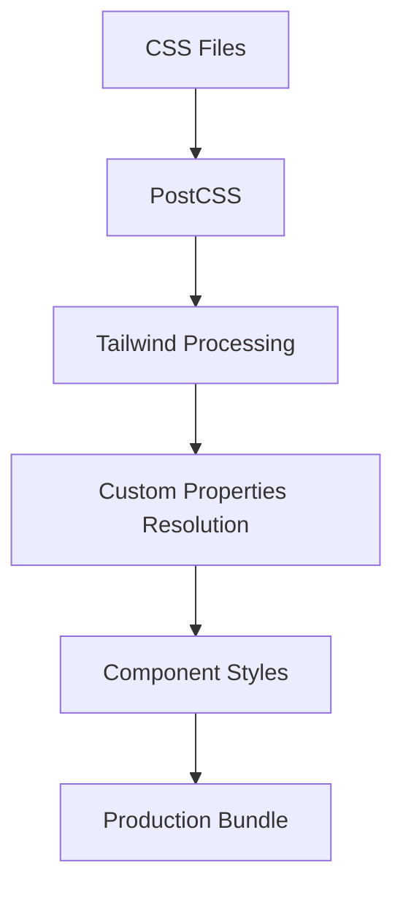

# PWA Styling Implementation Documentation

> **⚠️ REQUIRES UPDATES**: This document needs to be updated to reflect the current styling implementation. CSS architecture and component patterns may have changed.

**Pokemon Card Tracker - Technical Styling Architecture**

## Table of Contents
1. [Technical Overview](#technical-overview)
2. [Architecture & File Structure](#architecture--file-structure)
3. [Implementation Patterns](#implementation-patterns)
4. [CSS Processing Pipeline](#css-processing-pipeline)
5. [PWA-Specific Implementation](#pwa-specific-implementation)
6. [Styling Methodologies](#styling-methodologies)
7. [Component Implementation Patterns](#component-implementation-patterns)
8. [Build Configuration](#build-configuration)
9. [Technical Architecture Analysis](#technical-architecture-analysis)
10. [2024 Best Practices Comparison](#2024-best-practices-comparison)
11. [**🔍 COMPREHENSIVE MOBILE & DEVICE AUDIT**](#comprehensive-mobile--device-audit)

---

## Technical Overview

The Pokemon Card Tracker PWA implements a **hybrid styling system** that combines:

- **Tailwind CSS** (utility-first framework)
- **CSS Custom Properties** (theming & design tokens)
- **Atomic Design System** (components hierarchy)
- **PWA-specific optimizations** (safe areas, viewport handling)

### Key Technical Characteristics:
- **12+ CSS files** with different architectural purposes
- **Multi-layered cascade**: Base → Framework → Component → Utility
- **Class-based dark mode** with localStorage persistence
- **Responsive-first approach** with mobile PWA optimizations

---

## Architecture & File Structure

### **Primary Architecture Files**
```
src/
├── styles/
│   ├── main.css                 # Primary entry point
│   ├── variables.css            # CSS custom properties
│   ├── design-system.css        # Design system utilities
│   ├── shared.css               # Shared component styles
│   ├── ios-fixes.css            # iOS-specific PWA fixes
│   └── black-background.css     # Theme-specific styles
├── design-system/
│   ├── styles/
│   │   ├── colors.js            # Color system (JS export)
│   │   ├── component-library.css # Component base styles
│   │   ├── animations.css       # Animation utilities
│   │   └── formFixes.css        # Form-specific fixes
│   └── tokens/
│       └── index.js             # Design tokens centralization
└── tailwind.config.js           # Tailwind configuration
```

### **CSS Processing Pipeline**


---

## Implementation Patterns

### **1. Utility-First with Component Abstraction**
```javascript
// Example: SearchToolbar implementation
const toolbarClass = `search-toolbar w-full bg-white dark:bg-[#1B2131] py-3 px-4 flex flex-col sm:flex-row items-stretch sm:items-center gap-3 ${isDarkMode ? 'shadow-sm' : ''} rounded-md border border-[#ffffff33] dark:border-[#ffffff1a] ${className}`;
```

**Technical Pattern**: Long utility chains with conditional logic

### **2. CSS Custom Properties Integration**
```css
/* Design tokens approach */
:root {
  --primary: #ef4444;
  --primary-light: #f87171;
  --primary-dark: #dc2626;
}

/* Tailwind integration */
className="bg-[var(--primary)] hover:bg-[var(--primary-dark)]"
```

### **3. Dark Mode Implementation**
```javascript
// Class-based dark mode with localStorage
const { theme } = useTheme();
const isDarkMode = theme === 'dark';
```

**Technical Pattern**: React Context + localStorage + CSS classes

### **4. Responsive PWA Optimizations**
```css
/* iOS safe area handling */
padding-top: env(safe-area-inset-top);
padding-bottom: env(safe-area-inset-bottom);

/* PWA-specific viewport optimizations */
@media (display-mode: standalone) {
  /* PWA-specific styles */
}
```

---

## CSS Processing Pipeline

### **Build Process Flow**
1. **CSS Files Collected** → Multiple entry points
2. **PostCSS Processing** → Autoprefixer, custom plugins
3. **Tailwind Compilation** → Utility generation + purging
4. **Custom Properties** → CSS variables resolution
5. **Component Styles** → Component-specific processing
6. **Production Bundle** → Single optimized CSS file

### **Tailwind Configuration**
```javascript
// tailwind.config.js structure
module.exports = {
  content: ['./src/**/*.{js,jsx,ts,tsx}'],
  theme: {
    extend: {
      colors: {
        primary: colors.primary,
        // Custom color extensions
      }
    }
  },
  plugins: []
};
```

---

## PWA-Specific Implementation

### **Mobile Viewport Handling**
```css
/* iOS-specific fixes */
-webkit-overflow-scrolling: touch;
-webkit-appearance: none;
-webkit-tap-highlight-color: transparent;
```

### **Safe Area Implementation**
```css
/* Safe area insets for notched devices */
.safe-area-top { padding-top: env(safe-area-inset-top); }
.safe-area-bottom { padding-bottom: env(safe-area-inset-bottom); }
```

### **Standalone Mode Detection**
```css
@media (display-mode: standalone) {
  /* PWA-specific styling when installed */
  body { 
    background-color: var(--app-bg);
    padding-top: env(safe-area-inset-top);
  }
}
```

---

## Styling Methodologies

### **1. Utility-First Approach**
- **Primary Method**: Tailwind utility classes
- **Implementation**: Direct className application
- **Usage**: `className="flex items-center justify-between"`

### **2. Design Token System**
- **Method**: CSS custom properties + JS exports
- **Implementation**: Mixed CSS variables and Tailwind config
- **Usage**: `--primary` variables + `primary-500` utilities

### **3. Component-Based Styling**
- **Method**: React components with style encapsulation
- **Implementation**: Conditional className logic
- **Usage**: `${isDarkMode ? 'dark-styles' : 'light-styles'}`

### **4. Atomic Design Integration**
- **Method**: Atoms → Molecules → Organisms hierarchy
- **Implementation**: Styled components with increasing complexity
- **Usage**: `Button` → `Dropdown` → `SearchToolbar`

---

## Component Implementation Patterns

> **⚠️ Note**: This documentation needs to be updated with current implementation patterns. The actual component structure, styling methodologies, and CSS organization may differ from what's described here. 